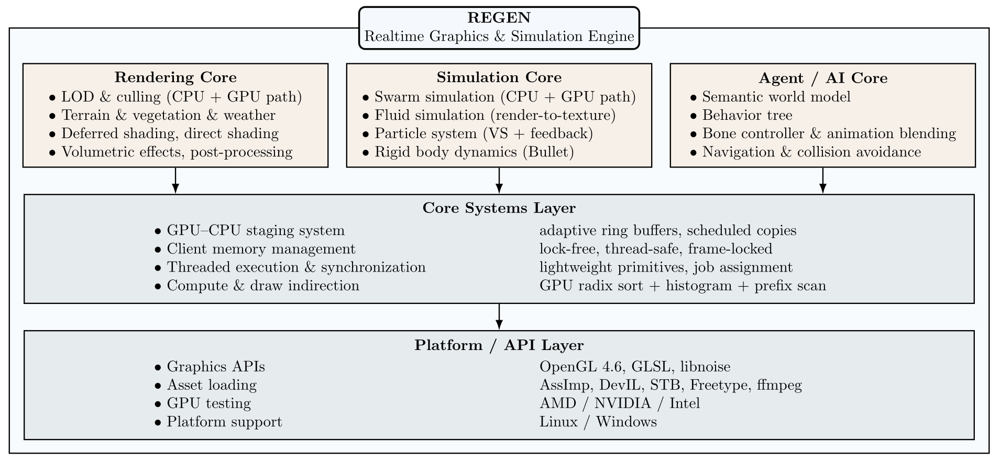

    

    
    
    
    

`regen` -- **Real-time Graphics Engine** -- is a modular OpenGL-based C++ engine designed for research and experimentation in real-time rendering, GPU compute, and virtual world simulation.

Unlike typical game engines, `regen` is built as a **computational framework**: it provides a unified runtime environment for **rendering**, **simulation**, and **AI behavior control**, where CPU and GPU workloads are explicitly modeled, profiled, and optimized.
It serves as a testbed for exploring **hybrid CPU–GPU algorithms**, **procedural world generation**, and **agent-based systems** in dynamic 3D environments.

A graphics card supporting the OpenGL 4.6 API is required for `regen`.
The engine was tested with NVIDIA, ATI and Intel drivers and should work with Unix based operating systems and Windows.

Some example renderings created by regen are shown in the GIFs above.
For each of them you can find an example configuration for regen [here](https://github.com/daniel86/regen/tree/master/applications/scene-display/examples).

Overview
=========================

    

| Subsystem    |    Description |
| ------------- | ------------- |
| Rendering Core    |    Modern OpenGL 4.6 pipeline with deferred and forward rendering paths, HDR lighting, PBR materials, post-processing, and volumetric effects. |
| GPU Compute Framework    |    Compute-shader-based LOD, culling, and simulation modules with shared memory abstractions and radix sorting for high parallel throughput. |
| AI & Simulation    |    Integrated support for multi-agent behavior control, including behavior trees, collision avoidance, flocking, and navigation with A* pathfinding. |
| World Model    |    Semantic representation of environment entities (locations, groups, and relationships), enabling high-level reasoning about scene composition and interaction. |
| Physics & Dynamics    |    GPU/CPU particle and boid systems, rigid-body interfaces, and environmental dynamics such as weather, wind, and water. |
| Animation System    |    Skeletal animation controller with per-bone updates, procedural blending, and integration with NPC decision layers. |
| Tools & Extensibility    |    XML-based scene descriptions, GLSL preprocessor extensions, and an easily hackable modular architecture for research and prototyping. |

Recent Highlights (Summer 2025)
=========================

Recent developments focus on agent intelligence and environmental interaction within the Regen framework:

- 🧭 **Navigation Controller**: Modular path planning based on A*, integrated with dynamic collision avoidance using quad-tree spatial indexing.
- 🤝 **Social Flocking**: Multi-agent behavior layer for group formation, coordination, and motion blending.
- 🧩 **Behavior Tree System**: Real-time decision logic for NPCs, allowing parallelized evaluation and seamless integration with animation and navigation layers.
- 🌍 **Semantic World Model**: World graph representing spatial relations, group memberships, and environmental semantics — enabling AI behaviors that respond to world structure.
- 💀 **Bone Animation Controller**: Procedural and data-driven animation blending for humanoid and animal agents, supporting layered control from behavior trees.

Features at a Glance
=========================

- 🔁 **Hybrid CPU & GPU LOD System**: Efficient Level of Detail (LOD) management using custom SIMD-optimized CPU code and GPU-based compute shaders. Includes GPU-based radix sort and dynamic LOD selection.
- 🧠 **Culling Optimizations**: Real-time view frustum culling on both CPU and GPU to minimize draw calls.
- 🪐 **Weather & Atmosphere Simulation**: Realistic dynamic weather including procedural thunderstorms, lightning flashes, wind, rain, snow, and atmospheric scattering.
- 🌲 **Procedural Terrain & Environment**:
  - Large-scale terrain rendering
  - Procedural grass and vegetation generation
  - Water surfaces with reflection, refraction, and wave animation
- 🐟 **GPU Flocking Simulation**: Real-time simulation of flocking behavior (boids) running both on GPU and CPU for benchmarking and experimentation.
- 🔥 **Particles**: GPU-simulated systems with configurable behaviors
- 🌌 **High-Quality Scene Rendering**: Deferred shading, volumetric effects, post-processing, physically-based lighting, and sky simulation.

These systems together form a complete simulation loop: from perception and reasoning to motion and rendering; within a fully customizable engine architecture.

Research & Experimentation Focus
=========================

`regen` is designed for **algorithmic exploration** and **systems research**. It enables controlled experimentation with:

- GPU-driven simulation and procedural content generation.
- Hybrid CPU–GPU workload balancing.
- SIMD optimization and data-oriented design.
- Integration of world semantics into real-time systems.
- Benchmarking between CPU and GPU implementations.

This makes it ideal not only for graphics programming but also for **AI–graphics integration research** and **engine architecture prototyping**.

Feature List
=========================
Here you find a brief list of supported features in this library.

- `Portability`: Tested on Windows and various Linux distributions. Tested with AMD, NVIDIA and Intel driver.
- `GPU + CPU Level-of-Detail (LOD) Handling`:
  - SIMD-optimized CPU implementation of LOD updates and sorting.
  - GPU compute shader implementation using parallel radix sort for fast LOD ranking.
  - Procedural mesh simplification
    - Mesh simplification using edge collapse
    - Impostor rendering: renders mesh from multiple angles to a texture atlas for billboarding
  - Frustum culling implemented both on CPU (with SSE) and GPU:
    - Per-object and per-instance frustum culling using compute shaders.
    - Optional CPU-side culling with SIMD acceleration and quad tree spatial index
- `Boid Simulation`:
  - Flocking algorithm with spatial partitioning.
  - GPU implementation using compute shaders, scales well to >100K boids
  - CPU version for comparison and debugging.
- `Procedural Terrain & Environments`:
  - Large-scale terrain rendering with LOD and tiled streaming.
  - Multi-layer procedural texturing and blending (e.g., grass, rock, snow).
  - Water rendering with reflections/refractions
  - Configurable weather system: thunder, rain, snow, fog, wind
- `Augmented GLSL`:
  - GLSL preprocessor extensions: `#include`, `#for`, and instanced attribute injection.
- `Modern GPU Resource Management`
  - Unified memory abstraction ("Coil") dynamically selects between UBO, SSBO, and TBO depending on platform limits and usage
  - Proper support for `std140` and `std430` layouts
  - Virtual memory allocator using buddy allocation, with precise alignment and bound checking
- `Scene Graph & Resource Loading`:
  - XML-based scene configuration.
  - Assimp integration for loading animated models (OBJ, PLY, 3DS, etc.).
- `Rendering Pipeline`:
  - Deferred and forward shading.
  - SSAO, FXAA, volumetric fog, tone mapping.
- `Realistic Sky Rendering`: Rayleigh and Mie scattering model, time-of-day transitions.
- `Volume Rendering`: Lightweight raycasting for scientific and artistic purposes.
- `Instancing & Picking`: Hardware instancing and robust object/instance picking.
- `Audio/Video`: 3D positional audio and video texture streaming support.

Dependency List
=========================
Following you can find a list of libraries that must be installed in order
to compile `regen`.
- [OpenGL](http://www.opengl.org/) >=3.3
- [Assimp](http://assimp.sourceforge.net/) >= 2.0
    - You have to copy the dll manually to binary dir on Win (.dll is not named like .lib)
- [DevIL](http://openil.sourceforge.net/) >= 1.4.0
- [FreeType](http://www.freetype.org/) >= 2.4.0
    - You might have to compile FreeType manually on Win. I had troubles linking against the binary distribution using VisualStudio, probably incompatible compilers.
- [Boost](http://www.boost.org/)
    - components: thread system date_time filesystem regex
    - compile options: --build-type=complete
- [Bullet](http://bulletphysics.org)
- [FFmpeg](http://www.ffmpeg.org/)
    - Optional, required for audio/video support.
    - Download `Dev` and `Shared` package from [here](http://ffmpeg.zeranoe.com/builds/) on Win. You have to copy the dll manually to binary dir (.dll is not named like .lib).
- [OpenAL Soft](http://kcat.strangesoft.net/openal.html) >=1.1 and [ALUT](http://connect.creativelabs.com/openal/Documentation/The%20OpenAL%20Utility%20Toolkit.htm)
    - Optional, required for audio/video support.
    - You might have to compile ALUT manually on Win. I had troubles linking against the binary distribution using VisualStudio, probably incompatible compilers.

In order to compile the test applications you will also need to install
the following list of libraries:
- [Qt](http://qt-project.org/) >=5.0 (QtCore, QtGui, QtOpenGL)
    - Note: use Qt5 installer for Win

Downloading
=========================
Clone the code from [github](https://github.com/daniel86/regen).
The dev branch contains the most up to date source code.
For each release you will find a custom branch.

Compiling
=========================
`regen` builds with [CMake](http://www.cmake.org/).
Run `cmake .` in the root directory to generate files needed for compiling.
On Unix systems CMake will generate Makefile's with usual targets.
Running `make` invokes the compiler and linker and
if `make` was successfull a static library `libregen.a`
was created in the root directory.
On Windows CMake generates Visual Studio files, just open them and compile from the IDE.

`regen` defines following build targets:

| Target     | Description                    |
|------------|--------------------------------|
| `all`      | Compile and link the engine.   |
| `install`  | Install compiled library.      |
| `doc`      | Generate doxygen documentation.|
| `package`  | Generate a regen package (archive file on Linux).|

CMake supports some default parameters for compiler and build path setup, consider the CMake documentations
for a complete socumentation of these arguments. Some important argument are listed below.

| CMake argument          | Description                       |
|-------------------------|-----------------------------------|
| CMAKE_INSTALL_PREFIX    | Path were the engine should get installed when the `install` target is used. |
| CMAKE_INCLUDE_PATH      | Path were you installed the dependency library headers. |
| CMAKE_LIBRARY_PATH      | Path were you installed the dependency libraries. |
| -G $GENERATOR_NAME      | Specifies custom build file generator. You might need to set this to "Visual Studio 11 Win64" when you intend to build the library for Win 64 Bit. |

Following you can find a list of `cmake` arguments with special handling in the `regen` build files:

| CMake argument          | Default | Description                                                                                             |
|-------------------------|---------|---------------------------------------------------------------------------------------------------------|
| -DCMAKE_BUILD_TYPE      | Release | One of `Release` or `Debug`. With Debug mode the engine is compiled with additional debugging symbols.  |
| -DBUILD_TESTS           | 0       | If set to 1 the test applications will be compiled by `all` target                                      |
| -DBUILD_VIDEO_PLAYER    | 0       | If set to 1 the video player application will be compiled by `all` target                               |

On Windows you might have to set environment variables for the dependency libraries.
Following you can find a list of those variables:

| Environment variable    | Description                       |
|-------------------------|-----------------------------------|
| GLEW_DIR                | Base path for GLEW library.       |
| Boost_DIR               | Base path for Boost library.      |
| ASSIMP_DIR              | Base path for Assimp library.     |
| FREETYPE_DIR            | Base path for Freetype library.   |
| DEVIL_DIR               | Base path for DevIL library.      |
| FFMPEG_DIR              | Base path for FFmpeg library.     |
| OPENAL_DIR              | Base path for OpenAL library.     |
| ALUT_DIR                | Base path for ALut library.       |
| BULLET_DIR              | Base path for Bullet library.     |

Videos of regen in action
=========================

    
    
    
    
    
    
    
    
    
    

📚 Documentation
=========================

Documentation is available at: https://daniel86.github.io/regen/

📬 Contact
=========================

Bug reports or feature requests? Use the GitHub issue tracker.
You can also reach me via email: daniel(at)orgizm.net.

❤️ Contributions
=========================

This engine was primarily developed for fun and exploration of real-time rendering techniques. If you find it useful or want to contribute, feel free to reach out or submit a PR.

